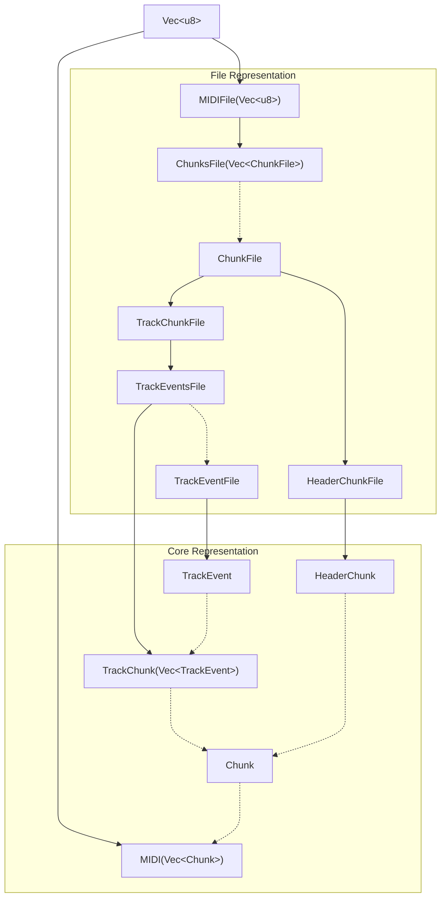

## Setup

```sh
rustup override set nightly
```

## Convert Diagram



## Specification

- [Standard MIDI Files 1.0](https://drive.google.com/file/d/1t4jcCCKoi5HMi7YJ6skvZfKcefLhhOgU/view)
- [MIDI Clip File Specification – SMF MIDI 2.0](https://midi.org/midi-clip-file-specification-smf-midi-2-0)
